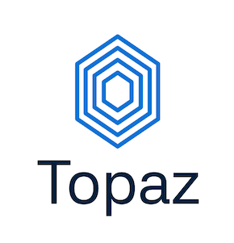

# Topaz  


<div align="center">
  
  
  <b>Local Azure environment emulation for development</b>
</div>

## What is Topaz?
Topaz is an Azure emulator, which allows you to develop Azure-based applications without a need to connect to cloud services. It mimics popular Azure components such as Azure Storage, Azure Key Vault or Azure Service Bus to provide a robust local environment. 

Note that Topaz is in early stage of its development and each new version may introduce breaking changes to the provided interface.

## Is Topaz free?
Yes, currently Topaz is free of any charges and doesn't require registration. This will change in the future, though you'll be notified about that fact several releases prior to it coming into life.

## Why Topaz?
Topaz offers a simplified DevEx by tightly integrating with moderns and popular tools used in development. You no longer need multiple emulators to start integrating with Azure services locally - all you need is a single executable (or Docker container). The set of capabilities offered by Topaz can be compiled into this short list:
* Support for both control & data plane of services
* Full portability
* Seamless integration with Azure SDK
* One-tool-to-rule-them-all
* Dedicated helpers for simplified connection and authentication
* Emulation of Azure resources' hierarchy including subscriptions and resource groups

There's also a backlog of features planned for future releases:
* UI for easier management of resources
* Emulation of Azure RBAC
* Emulation of ARM deployments using ARM Templates / Bicep

## Alternatives
If you want to work with emulators for Azure services, you have a couple of options:
* Azurite - https://github.com/Azure/Azurite
* Azure Cosmos DB Emulator - https://github.com/Azure/azure-cosmos-db-emulator-docker
* Azure Service Bus Emulator - https://github.com/Azure/azure-service-bus-emulator-installer

## How to install Topaz?
Topaz doesn't require installation and can be run as either a single executable or a Docker container. If you want to run it as a standalone application, make sure you've installed and trusted certificates (unless you don't need to use HTTPS endpoints). The certificates are attached to each release package. We strongly recommend running Topaz as a Docker container though as it saves you from complexity of local installation:
```
docker run --rm thecloudtheory/topaz-cli:<tag>
```
Image tags are always aligned with the Git tag linked to a specific release.

One of the best options to run Topaz is to leverage [Testcontainers](https://testcontainers.com/). Check the `Examples` directory in this repository for detailed code snippets.

## NuGet packages
Topaz provides a set of NuGet packages, which can be used to simplify configuration, authenticate to your local environment and integrate with certain types of applications (e.g. ASP.NET Core):
* [TheCloudTheory.Topaz.Identity](https://www.nuget.org/packages/TheCloudTheory.Topaz.Identity/)
* [TheCloudTheory.Topaz.ResourceManager](https://www.nuget.org/packages/TheCloudTheory.Topaz.ResourceManager/)
* [TheCloudTheory.Topaz.AspNetCore.Extensions](https://www.nuget.org/packages/TheCloudTheory.Topaz.ResourceManager/)

Once installed, they enable to you get started with the emulator without much of a hassle:
```
var credentials = new AzureLocalCredential();
var client = new SecretClient(
  vaultUri: TopazResourceHelpers.GetKeyVaultEndpoint(keyVaultName),
  credential: credentials,
  new SecretClientOptions
  {
    DisableChallengeResourceVerification = true
});
```
Check the `Examples` directory in the repository for other use cases and scenarios.

## Supported services
Topaz is in an early stage of development so currently it provides a limited support for a subset of Azure services. You can find current status of development below:
Service Name|Control Plane|Data Plane
------------|-------------|----------
Subscriptions|⚠️|N/A
Resource Groups|⚠️|N/A
Azure Storage|⚠️|⚠️
Table Storage|⚠️|✅
Blob Storage|⚠️|⚠️
Queue Storage|:x:|:x:
Key Vault|⚠️|⚠️
Event Hub|⚠️|⚠️

✅ - fully supported (stable)

⚠️ - partially supported (unstable)

:x: - not supported

`N/A` - not provided by Azure
