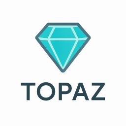

# Topaz

Local Azure environment emulation for development

## Installation

### Local certificate
To be able to interact with HTTPS endpoints provided by the emulator, you will need to install and trust the certificate locally. The certificate (`localhost.pfx`) is available in the `Azure.Local.Host` project.

## Differences

The differences between the emulator and the actual service.

### Table Service
* `Update` and `Merge` operations are performed in the same way, i.e. emulator always replaces an entity, even if `Merge` is requested
