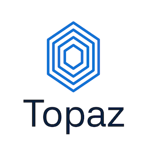

# Topaz   [](https://discord.gg/eGTkS76w)

<div align="center">
  

  <b>One binary. Multiple Azure services. No cloud required.</b>
</div>

## What is Topaz?

Topaz is a single-binary Azure emulator. Instead of running Azurite for Storage, a separate emulator for Service Bus, and another for Key Vault — you run one tool.

It supports both the control and data planes of Azure services, emulates ARM deployments with Bicep and ARM Templates, and implements Azure RBAC, all locally with no Azure subscription required. Teams use it to cut cloud costs, speed up CI pipelines, and develop entirely offline.

Check the [documentation](https://topaz.thecloudtheory.com/) for guides, recipes, and a full list of supported services.

## Why Topaz?

Most Azure emulators cover a single service. Topaz covers the full stack:

* **One tool** — no more juggling multiple emulators per service
* **Control & data plane** — not just data operations, but full resource management
* **ARM / Bicep / Terraform deployments** — deploy templates locally the same way you would in Azure
* **Azure RBAC emulation** — role assignments and permission checks work locally
* **Microsoft Entra ID tenant emulation** — identity flows without a real tenant
* **Azure resource hierarchy** — management groups, subscriptions, resource groups, and resource IDs behave as expected
* **Seamless Azure SDK integration** — no code changes; point your SDK at Topaz
* **Full portability** — single executable or Docker container, runs anywhere

See the [roadmap](https://topaz.thecloudtheory.com/docs/roadmap) for what's coming next.

## Supported services

| Service | Control Plane | Data Plane | Status |
|---|---|---|---|
| Azure Storage (Blob) | ✅ | ✅ | Preview |
| Azure Storage (Table) | ✅ | ✅ | Preview |
| Azure Key Vault | ✅ | ✅ | Preview |
| Azure Service Bus | ✅ | ✅ | Preview |
| Azure Container Registry | ✅ | ✅ | Preview |
| Azure Event Hub | ✅ | ✅ | Preview |
| Azure Resource Manager | ✅ | — | Preview |
| Microsoft Entra ID | ✅ | — | Preview |

See the [API coverage docs](https://topaz.thecloudtheory.com/docs/api-coverage/) for the full operation-level breakdown per service.

## Getting started

```bash
# Install with Homebrew (macOS)
brew tap thecloudtheory/topaz
brew install topaz

# Run with Docker
docker run -p 8891:8891 -p 8892:8892 -p 8898:8898 thecloudtheory/topaz-host

# Or download the binary and run directly
topaz-host
```

Point your Azure SDK at the relevant local port — no code changes required. To verify Topaz is running, try listing resource groups with the Azure CLI:

```bash
az group list --output table
```

See the [documentation](https://topaz.thecloudtheory.com/) for connection strings, SDK setup, and service-specific quickstarts.

## CI/CD integration

Topaz runs as a service step in any pipeline — no Azure subscription, service principal, or network access required. See the [CI/CD integration guide](https://topaz.thecloudtheory.com/docs/ecosystem/ci-cd) for GitHub Actions and Azure DevOps examples.

For a ready-to-copy, manual-only GitHub Actions workflow, use [.github/workflows/topaz-ci.yml](.github/workflows/topaz-ci.yml).

## Terraform integration

Topaz supports local Terraform workflows with both the AzureRM and AzAPI providers — no real Azure subscription required. See the [Terraform integration guide](https://topaz.thecloudtheory.com/docs/terraform-integration) for setup instructions, including DNS configuration and provider examples.

## Licensing

Topaz is open-source. A commercial license with enterprise support is planned for teams that need SLAs, priority fixes, or long-term stability guarantees. Existing users will receive advance notice well before any licensing changes take effect.

## Community

Questions, ideas, and feedback are welcome in [GitHub Discussions](https://github.com/TheCloudTheory/Topaz/discussions). For bugs, open an [issue](https://github.com/TheCloudTheory/Topaz/issues). Contributions are welcome — see [CONTRIBUTING.md](CONTRIBUTING.md) for details.

## Alternatives

If you need emulation for a single Azure service, these official Microsoft tools may be sufficient:

* [Azurite](https://github.com/Azure/Azurite) — Azure Storage only
* [Azure Cosmos DB Emulator](https://github.com/Azure/azure-cosmos-db-emulator-docker) — Cosmos DB only
* [Azure Service Bus Emulator](https://github.com/Azure/azure-service-bus-emulator-installer) — Service Bus only

If you need multiple services, RBAC, or ARM deployments locally, that's where Topaz fits.

## Privacy

All state is local. Topaz never makes outbound calls and never transmits credentials or resource data to external services.
