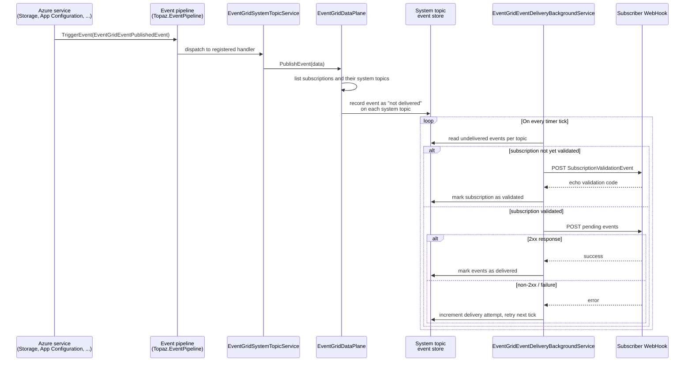

# Event Grid system topics

Azure services emit events when resources change — a blob is created, a Key Vault secret expires, an App Configuration key is modified. In real Azure, these events flow through a **system topic**: a built-in Event Grid topic that Azure manages on behalf of a resource, without you having to create or publish to it yourself. Topaz emulates this same flow so that event-driven applications built against system topics work locally.

## Why system topics are different from custom topics

A **custom topic** is a topic you create explicitly and publish events to yourself, using the Event Grid data plane (`topaz eventgrid topic ...` or the `EventGridPublisherClient` SDK).

A **system topic** is different: you don't publish to it directly. Instead, you register a system topic against an existing resource (a storage account, an App Configuration store, and so on), and Azure — or, locally, Topaz — publishes events to it automatically whenever that resource changes.

```bash
topaz eventgrid system-topic create \
    --subscription-id "00000000-0000-0000-0000-000000000000" \
    --resource-group "rg-local" \
    --name "my-system-topic" \
    --location "westeurope" \
    --source "/subscriptions/00000000-0000-0000-0000-000000000000/resourceGroups/rg-local/providers/Microsoft.Storage/storageAccounts/mystorage" \
    --topic-type "Microsoft.Storage.StorageAccounts"
```

Once created, subscribing to it (`system-topic subscription create` with a WebHook destination) is enough to start receiving events for activity on the referenced resource — no explicit publish call is ever made by your application code.

## End-to-end flow



The producing service never talks to Event Grid directly — it only announces a fact on the shared pipeline. Everything from fan-out to system topics, through the validation handshake, to at-least-once delivery is owned by the Event Grid service itself.

## The internal event pipeline

Topaz's services don't call the Event Grid data plane directly when something changes. Instead, they raise events on a shared, in-process **event pipeline** (`Topaz.EventPipeline`). Any service that wants to notify Event Grid of a state change — for example App Configuration, after a key-value is set or deleted — triggers an `EventGridEventPublishedEvent`:

```csharp
eventPipeline.TriggerEvent<EventGridEventPublishedEventData, EventGridEventPublishedEvent>(
    new EventGridEventPublishedEvent
    {
        Data = new EventGridEventPublishedEventData
        {
            ResourceId = ...,
            Subject = ...,
            EventType = ...,
            Data = ...
        }
    });
```

`EventGridSystemTopicService` registers a handler for this event at startup. When it fires, `EventGridDataPlane.PublishEvent` runs:

1. List every subscription known to Topaz.
2. For each subscription, list its system topics.
3. Write the event as a subresource under each system topic, marked as not yet delivered.

This decouples the service that produced the event (Storage, App Configuration, Key Vault, and so on) from Event Grid entirely — the producing service has no knowledge of which system topics or subscriptions exist. It only announces "something happened," and Event Grid's own code fans that announcement out.

:::note
Topaz's current implementation stores the event against every system topic in the subscription rather than filtering by the topic's `source` and `topicType`. This is a known simplification — see [Service emulation design](./service-emulation-design.md) for how Topaz treats gaps like this.
:::

## Delivery to subscribers

Storing an event against a system topic isn't the same as delivering it. Delivery is handled separately by `EventGridEventDeliveryBackgroundService`, a background job that runs on a fixed interval for as long as `topaz-host` is up. On each tick it:

1. Lists every subscription and every Event Grid topic (including system topics) in it.
2. Reads the events recorded against each topic that haven't been marked as delivered yet.
3. For each event subscription registered against the topic, dispatches the pending events to the subscription's destination.

Only the `WebHook` destination type is currently supported; other destination types are logged and skipped.

### Endpoint validation handshake

Before Event Grid delivers real events to a WebHook endpoint, Azure requires proof that the endpoint owner actually wants to receive them — the [subscription validation handshake](https://learn.microsoft.com/en-us/azure/event-grid/webhook-event-delivery). Topaz replicates this: the first time a subscription's destination is used, `EventGridEventDeliveryBackgroundService` sends a `Microsoft.EventGrid.SubscriptionValidationEvent` instead of real events, and expects the endpoint to echo back the validation code in its response. Once validated, the subscription is recorded, and subsequent ticks deliver actual event data to that endpoint instead.

### Delivery status tracking

Each event envelope tracks whether it has been delivered and how many delivery attempts have been made:

- On a successful (`2xx`) response from the destination, the event is marked as delivered and won't be resent.
- On any other response, the delivery attempt counter is incremented and the event remains pending for the next tick.

This mirrors the at-least-once delivery model Event Grid uses in real Azure, without implementing the full exponential backoff and dead-lettering policy that the real service applies.

## Why this matters for local development

Because the event pipeline sits between the producing service and Event Grid, adding Event Grid support for a new resource type only requires that service to trigger `EventGridEventPublishedEvent` — the system topic storage, delivery loop, and validation handshake are already shared infrastructure. From your application's perspective, the effect is the same as in real Azure: create a system topic against a resource, subscribe a WebHook to it, and it starts receiving events for that resource's activity without any explicit publish call.
